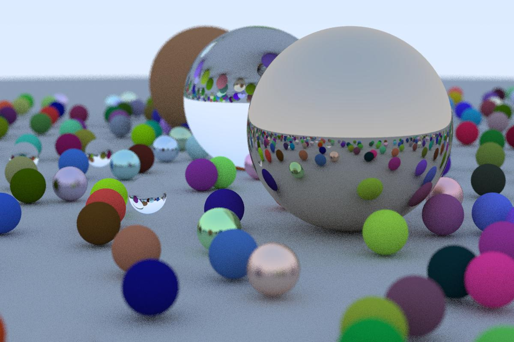

# rtiow

My code from [_Ray Tracing in One Weekend_](https://raytracing.github.io/books/RayTracingInOneWeekend.html). The code follows the tutorial quite closely due to my inexperience with C++. The main differences are variable names (eg shape3/shape3_list instead of hittable/hittable_list) and that my code does not include the "main.h" file so dependencies are more explicit.

To use code (in linux):
```
clang++ main.cc -o gen_img.out
gen_img.out > image.ppm
```
and then open the image.ppm with a ppm-compatible image viewer.

The image below was (slowly) generated using the current settings and then converted from ppm to jpg. These settings can be tweaked in the "Image" section of the main() function.


